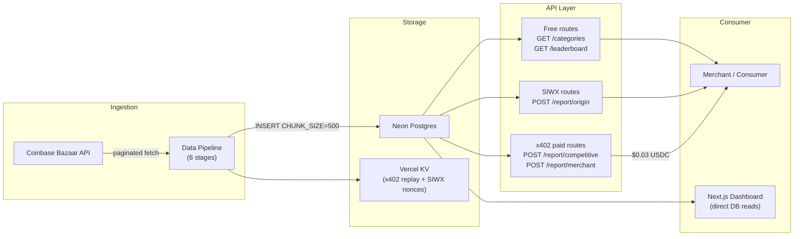
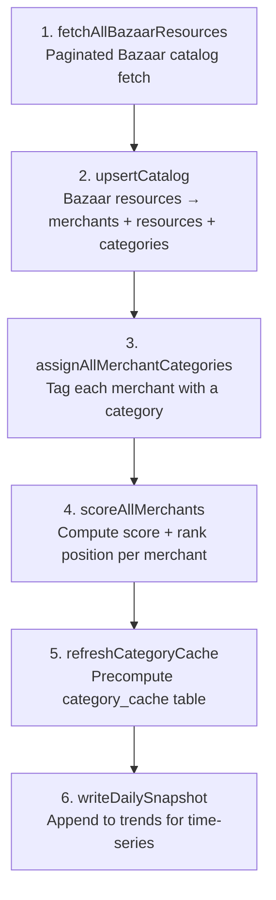
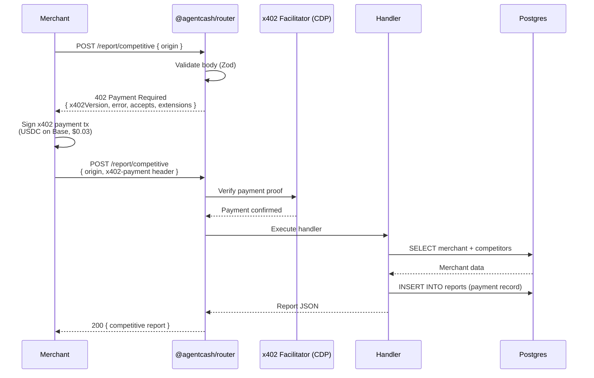
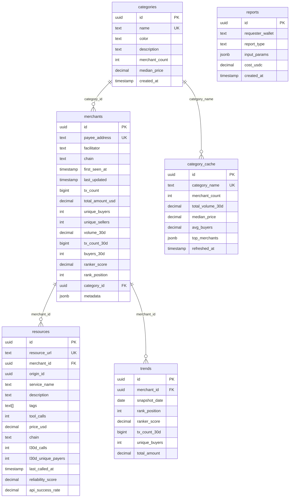

# Decipher Ranker — Architecture

A merchant-analytics API for the x402 micropayment ecosystem. It ingests the Coinbase Bazaar marketplace catalog, scores every merchant on a proprietary ranking formula, and exposes ranking reports — some free, some paid via x402 micropayments. A read-only Next.js dashboard renders the same data directly from Postgres.

## Architecture Overview



**Tech stack:** Next.js 15 (App Router), Neon Serverless Postgres, Drizzle ORM, `@agentcash/router` (x402/SIWX), Vercel KV (Upstash), TypeScript.

**Two consumer paths** that share the same Postgres schema but interact differently:

| Path | Entry point | Auth | Data source |
|---|---|---|---|
| Public API | `src/app/api/**` | x402 / SIWX / unprotected | Router-wrapped handlers → Postgres |
| Dashboard | `src/dashboard/**` | None (read-only) | Direct DB queries via `src/dashboard/lib/api.ts` |

The dashboard does **not** call `/api/*` endpoints — it queries Postgres directly. The two layers are independent consumers of the same schema.

## Data Pipeline Architecture

Six stages run in strict order. Each stage reads what the previous stage wrote.



**Pipeline triggers:**
- `npm run seed` — truncates all tables, rebuilds from scratch
- `npm run refresh` — incremental, idempotent upsert (no truncate)
- `GET /api/cron/refresh-catalog` — same pipeline as refresh, guarded by `CRON_SECRET` bearer token

Both `seed` and `refresh` wrap `scripts/run-pipeline.ts`, which exports `runPipeline(fresh: boolean)`.

### Stage 1: `fetchAllBazaarResources` (`src/lib/data-sources/bazaar.ts`)

Paginated fetch from `https://api.cdp.coinbase.com/platform/v2/x402/discovery/resources?limit=100&offset=N`. Respects a 100ms rate limit delay between pages. This is the slowest stage (~4 minutes for the full catalog).

### Stage 2: `upsertCatalog` (`src/lib/data-sources/catalog-sync.ts`)

Groups Bazaar resources by `payTo` address → creates `merchants` rows. Extracts tags from all resources → creates `categories` rows (unique tag names). Inserts individual `resources` rows linked to merchants. All via chunked upserts (`INSERT_CHUNK_SIZE = 500`).

**Two critical data transformations:**
1. **Atomic prices:** Bazaar amounts arrive in the asset's smallest units (USDC has 6 decimals: `"1000000000"` = $1000). `extractPriceUsd` divides by `10**decimals` and clamps to `[0, 1_000_000]`. Price DB columns are `DECIMAL(20,6)`.
2. **NUL bytes:** Free-text Bazaar fields can contain `\u0000`, which Postgres text columns reject. `sanitizeText` strips them in `catalog-sync.ts`.

### Stage 3: `assignAllMerchantCategories` (`src/lib/analytics/categorizer.ts`)

Matches merchant resources' tags against known category names. Issues one batched `UPDATE` per category (not one per merchant). Also updates `merchant_count` and `median_price` on the `categories` table via `PERCENTILE_CONT`.

### Stage 4: `scoreAllMerchants` (`src/lib/analytics/ranker.ts`)

Computes a `ranker_score` for every merchant (see formula below), then assigns `rank_position` within each category via a single windowed statement:

```sql
ROW_NUMBER() OVER (PARTITION BY category_id ORDER BY ranker_score DESC)
```

Unassigned merchants (no category) get a global rank. Both operations run as single SQL statements — no per-category loop.

### Stages 5-6: Cache + Trends

`refreshCategoryCache` precomputes per-category stats (merchant count, total volume, avg buyers, top-5 merchants) into `category_cache`. `writeDailySnapshot` copies each merchant's current state into `trends` for time-series queries.

## The Ranker Score

The core of the product:

```
0.30·volumeSignal + 0.25·buyerDiversity + 0.15·reliability + 0.15·listingQuality + 0.15·recency
```

Result is rounded to 4 decimal places (`Math.round(score * 10000) / 10000`). Defined in `computeRankerScore` at `src/lib/analytics/ranker.ts:13`.

### Component 1: Volume Signal (30%)

```typescript
// src/lib/analytics/ranker.ts:16-18
0.5 * logNorm(merchant.txCount30d ?? 0) +
0.5 * logNorm(Number(merchant.volume30d ?? 0))
```

`logNorm(value, cap=1_000_000)` maps value to `[0, 1]` via `log10(value + 1) / log10(cap)`. A merchant with 1M transactions or 1M in volume hits 1.0. Combining transaction count and dollar volume prevents cheap APIs with many $0 calls from dominating.

**Source:** `txCount30d` and `volume30d` come from Bazaar's `l30DaysTotalCalls` summed across all resources belonging to a merchant.

### Component 2: Buyer Diversity (25%)

```typescript
// src/lib/analytics/ranker.ts:20,57-59
logNorm(merchant.buyers30d ?? 0, 10_000)
```

Measures unique wallet diversity. Capped at 10,000 (a service with 10k unique buyers hits 1.0). Higher diversity → less concentration risk → better ranking.

**Source:** `buyers30d` comes from Bazaar's `l30DaysUniquePayers` summed across merchant resources.

### Component 3: Reliability (15%)

```typescript
// src/lib/analytics/ranker.ts:69-78
function computeReliability(merchantResources: Resource[]): number {
  const scores = merchantResources
    .map((r) => Number(r.reliabilityScore ?? r.apiSuccessRate ?? 0))
    .filter((s) => s > 0);
  if (scores.length === 0) return 0.5; // fallback for no data
  return scores.reduce((a, b) => a + b, 0) / scores.length;
}
```

Averages either `reliabilityScore` (x402scan-reported) or `apiSuccessRate` across all resources. Falls back to 0.5 for merchants with no reliability data — neutral, not punitive.

### Component 4: Listing Quality (15%)

```typescript
// src/lib/analytics/ranker.ts:80-97
// Per-resource scoring:
let score = 0;
if (description > 150 chars) score += 1.0;
else if (description > 50 chars) score += 0.6;
else if (description > 0 chars) score += 0.3;
if (tags && tags.length > 0) score += 0.2;
// Capped at 1.0: min(score / 1.2, 1)
// Final: average across all resources
```

Measures how well a merchant presents their API. Description length is the primary signal (150+ chars = full points); tags add a minor boost. Score per resource capped at 1.0.

### Component 5: Recency (15%)

```typescript
// src/lib/analytics/ranker.ts:99-117
const daysSince = (now - mostRecent) / (1000 * 60 * 60 * 24);
if (daysSince < 1)  return 1.0;   // Today
if (daysSince < 7)  return 0.8;   // This week
if (daysSince < 30) return 0.5;   // This month
if (daysSince < 90) return 0.2;   // This quarter
return 0;                          // Inactive
```

Uses `max(lastCalledAt, lastUpdated)` across all resources. Penalizes stale listings — a merchant that hasn't been called in 90+ days gets 0 for this component.

### Why Each Component Maps to Actionable Behavior

| Component | What it tells a merchant |
|---|---|
| Volume | "Get more transaction volume — traffic correlates with quality" |
| Buyer Diversity | "Diversify your customer base — reliance on few wallets hurts your ranking" |
| Reliability | "Keep your API uptime high — failures are averaged across all your endpoints" |
| Listing Quality | "Write detailed descriptions (150+ chars) and tag your resources — better listings rank higher" |
| Recency | "Stay active — services unused for 90+ days get zero for this component" |

## Endpoint Reference

### Free (no auth)

**`GET /categories`** — `.unprotected()`

Returns all categories with merchant counts, median pricing, and top-3 merchants per category.

- **What Bazaar provides:** Tag names (which become category names)
- **What we compute:** `merchant_count` (`src/lib/analytics/categorizer.ts:72-79`), `median_price` (PERCENTILE_CONT across all resources in the category, `categorizer.ts:81-89`), top-3 merchants per category by ranker_score (windowed `ROW_NUMBER`, `categories/route.ts:20-44`)

```
Response: {
  categories: [{
    name: string,
    merchant_count: number,
    median_price_usd: number | null,
    top_merchants: [{ address, score, volume_30d }]
  }],
  total: number
}
```

**`GET /leaderboard`** — `.unprotected()`

Returns top N merchants ranked by decipher score, optionally filtered by category.

Query params: `category` (string, optional), `limit` (1-100, default 50).

```typescript
// Query construction in src/app/api/leaderboard/route.ts:43-55
const results = await db.query.merchants.findMany({
  where: categoryId ? eq(merchants.categoryId, categoryId) : undefined,
  orderBy: [desc(merchants.rankerScore)],
  limit,
});
```

- **What Bazaar provides:** Raw metrics per resource (call counts, buyer counts)
- **What we compute:** The full ranking — Bazaar has no leaderboard concept

### SIWX (free, wallet identity required)

**`POST /report/origin`** — `.siwx()`

Free basic report for a merchant's own origin. Requires SIWX wallet identity proof (no payment).

Body: `{ origin: "https://mesh.heurist.xyz" }`

```typescript
// Response computed in src/app/api/report/origin/route.ts:32-44
{
  found: boolean,
  origin: string,
  category: string | null,          // Which category we classified you into
  rank_position: number | null,     // Your position within your category
  total_competitors: number,        // How many merchants in your category
  price_position: "below_median" | "median" | "above_median",
  description_quality: number,      // 0-100 score on how good your listing is
  listing_completeness: number,     // 0-100 score (name, desc, tags, price)
  tips: string[],                   // Up to 3 actionable recommendations
  last_updated: string             // ISO date
}
```

**What's unique:** The `price_position` (computed by `computePricePosition` at `ranker.ts:204`, comparing merchant's avg price to category median ±10%), `description_quality` (ranker.ts:226), `listing_completeness` (ranker.ts:240), and `tips` (ranker.ts:256) are all computed. Bazaar provides none of this.

### x402 Paid ($0.03 USDC each)

**`POST /report/competitive`** — `.paid("0.03")`

Deep competitive analysis. Returns top-10 competitors with gap analysis, pricing benchmarks, and recommendations.

Body: `{ origin: "https://mesh.heurist.xyz" }`

```typescript
// Response structure from src/app/api/report/competitive/route.ts:42-66
{
  found: boolean,
  origin: string,
  category: string | null,
  your_rank: number | null,
  total_competitors: number,
  competitors: [{                    // Top 10, sorted by score desc
    origin, rank, score, price,
    unique_buyers, tool_calls, description_length
  }],
  gap_analysis: {                    // What you're missing vs competitors
    missing_tags: string[],          // Tags competitors use that you don't
    missing_keywords: string[],      // Keywords in competitor descriptions
    competitor_count: number
  },
  pricing_benchmark: {               // Where your price sits in the market
    your_price, category_median,
    category_min, category_max, percentile
  },
  recommendations: string[]          // Up to 5 prioritized actions
}
```

**What's unique:** The `gap_analysis` is computed by `computeGapAnalysis` in `src/lib/analytics/comparator.ts` — it extracts tags and keywords from competitor descriptions, identifies what the target merchant is missing. The `pricing_benchmark` compares the merchant's price against the full competitive set. Bazaar provides raw price data per resource; it does not compute percentiles or gap analysis.

**`POST /report/merchant`** — `.paid("0.03")`

Deep dive into a specific merchant by wallet address.

Body: `{ address: "0xe903...", chain: "base" | "solana" }`

```typescript
// Response structure from src/app/api/report/merchant/route.ts:53-78
{
  found: boolean,
  address: string,
  chain: string,
  service_name: string | null,
  category: string | null,
  rank: number | null,
  volume: {
    total_transactions, total_volume_usd,
    volume_30d, tx_count_30d
  },
  buyers: {
    total_unique, unique_30d,
    concentration,              // HHI-derived: 0 = even, 1 = one buyer dominates
    diversity_score
  },
  pricing: {
    price_usd: number | null,
    vs_category: "below_median" | "median" | "above_median"
  },
  trends: [{
    date: string,
    rank: number | null,        // Historical rank position
    score: number | null         // Historical score
  }],
  recommendations: string[]
}
```

**What's unique:** `buyers.concentration` uses an HHI-inspired formula (`computeBuyerConcentration` at `ranker.ts:61-66` — a modified Herfindahl-Hirschman Index that measures buyer concentration risk). `trends` is a 30-day time-series from the `trends` table, showing how a merchant's rank and score have evolved. Neither of these exists in Bazaar.

### Cron + Discovery

**`GET /api/cron/refresh-catalog`** — Bearer token (`CRON_SECRET`)

Standalone handler (not router-wrapped). Runs the full pipeline and returns a stats summary. Intended for Vercel Cron Jobs or manual trigger.

**`GET /openapi.json`** — Auto-generated from route registry

**`GET /.well-known/x402`** — x402 service descriptor

**`GET /llms.txt`** — LLM-readable service summary

All three discovery endpoints import `@/lib/routes-barrel` via side-effect so the router's registry reflects every registered route.

## x402 Payment Flow



The 402 challenge response from `@agentcash/router` includes:

```json
{
  "x402Version": 2,
  "error": "SIWX authentication required",
  "resource": {
    "url": "http://localhost:3000/api/report/origin",
    "description": "Get a free basic ranking report...",
    "mimeType": "application/json"
  },
  "accepts": [],
  "extensions": {
    "sign-in-with-x": {
      "info": {
        "domain": "localhost",
        "uri": "http://localhost:3000/api/report/origin",
        "version": "1",
        "chainId": "eip155:8453",
        "type": "eip191",
        "nonce": "...",
        "issuedAt": "...",
        "expirationTime": "...",
        "statement": "Sign in to verify your wallet identity"
      },
      "supportedChains": [{ "chainId": "eip155:8453", "type": "eip191" }]
    }
  }
}
```

The router library handles all x402 and SIWX negotiation — the route handlers only see validated body + `wallet` (payer address). Payment verification and settlement are transparent.

## Database Schema



**Table purposes:** `merchants` (1 per payee, aggregates resources), `resources` (1 per Bazaar URL, raw listing data), `categories` (1 per unique tag, seeded in pipeline stage 2), `category_cache` (precomputed per-category aggregates for dashboard), `trends` (daily merchant snapshots for time-series), `reports` (audit log of every paid/SIWX request).

## Security Model

| Mechanism | Purpose | Protocol |
|---|---|---|
| `.unprotected()` | Open data (categories, leaderboard) | None |
| `.siwx()` | Wallet identity verification, no payment | SIWX (Sign-In-With-X) |
| `.paid($0.03)` | Micropayment before handler executes | x402 (USDC on Base, CDP facilitator) |
| `CRON_SECRET` | Bearer token for pipeline trigger | HTTP `Authorization: Bearer` |
| KV store | Nonce tracking for SIWX replay protection | Vercel KV / Upstash Redis |
| MPP (optional) | Session-based micropayments (lower per-call cost) | MPP via Tempo |

The `@agentcash/router` validates all five env vars at boot (`BASE_URL`, `EVM_PAYEE_ADDRESS`, `CDP_API_KEY_ID`, `CDP_API_KEY_SECRET`, `KV_REST_API_URL`, `KV_REST_API_TOKEN`) and throws a single `RouterConfigError` listing every problem. A `mock://` KV URL will not work — SIWX and x402 both require a real Upstash instance.
