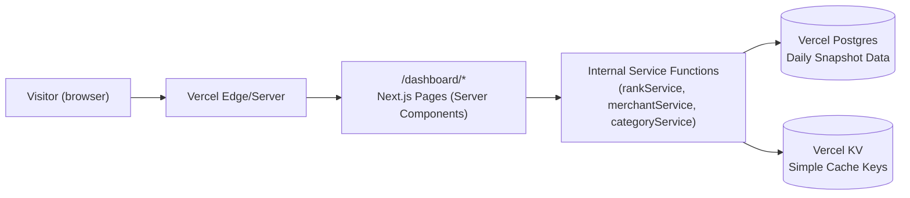

# decipher-ranker — Analytics Dashboard Architecture

**Date:** 2026-06-29
**Status:** Preliminary Architecture — ready for coding agent
**Domain:** decipher-ranker.com/dashboard/*
**Hosting:** Vercel (Next.js App Router) — same project as x402 service
**Framework:** Next.js 15 + Tailwind CSS + Recharts
**Auth Model:** Fully public (no SIWX wall)

---

## Table of Contents

1. Project Overview
2. Dashboard Principles
3. Tech Stack & Decisions
4. Directory Structure
5. Page Specifications
6. Component Tree
7. Data Flow
8. Design System
9. Deployment & Route Configuration
10. Validation Checklist
11. Stretch Goals (Post-MVP)

---

## 1. Project Overview

### What is the decipher-ranker analytics dashboard?

The analytics dashboard is the public-facing UI for decipher-ranker. While the x402 service delivers programmatic rank reports via paid/SIWX API endpoints, the dashboard lets any visitor browse the x402 ecosystem visually — no wallet, no payment, no sign-up.

### Relationship to the x402 service

- **Same codebase, same deployment.** The dashboard lives at `/dashboard/*`, the x402 API at `/api/*`. Both share the same Next.js app, database, and internal service modules.
- **Zero marginal cost per pageview.** Dashboard pages call internal service functions directly (not through the x402 router). The daily snapshot data is served from Vercel Postgres — no upstream API calls at render time.
- **Complementary roles.** The x402 service answers "what's my rank and how do I improve?" (personal, paid, API-native). The dashboard answers "what does the ecosystem look like?" (public, browseable, visual).

### Architecture diagram



---

## 2. Dashboard Principles

1. **Public-first.** Every page must be accessible without wallet, payment, or sign-in. Auth adds friction with no benefit for ecosystem-browse use cases.
2. **Snapshots, not live queries.** All data comes from the daily Postgres snapshot. Dashboard loads never trigger upstream x402scan or Bazaar API calls.
3. **Linkable.** Every merchant, category, and leaderboard entry must have a stable URL. Users share links, not search results.
4. **Progressive enhancement.** Core content (leaderboard tables, merchant stats, category lists) renders as Server Components. Interactive elements (search, chart toggles, sort) hydrate on the client.
5. **Fast by default.** Static rendering where possible, ISR for leaderboard/categories, server-rendered for merchant pages. Target sub-200ms TTFB.

---

## 3. Tech Stack & Decisions

### Stack

| Layer | Choice | Rationale |
|-------|--------|-----------|
| Framework | Next.js 15 (App Router) | Same as x402 service; shared routing, build, deploy |
| Styling | Tailwind CSS 4 | Utility-first, zero runtime, consistent with x402 service |
| Charts | Recharts | Lightweight, React-native, composable bar/radar/line charts |
| Icons | lucide-react | Simple, consistent icon set |
| Data layer | Direct Postgres queries via `@vercel/postgres` | No ORM needed for read-only snapshot queries |
| Caching | `next/cache` + Vercel KV | ISR revalidation + simple key-value for computed aggregates |
| Type safety | TypeScript | Shared types with x402 service module |
| State | URL search params + React Server Components | Minimal client state, no zustand/redux needed |

### What we explicitly chose *not* to use

| Library | Reason |
|---------|--------|
| Auth library (NextAuth, SIWX) | Dashboard is fully public — no auth surface |
| ORM (Prisma, Drizzle) | Read-only queries against 6 tables; raw SQL is simpler and zero overhead |
| Client state library | URL params + server components cover every use case in MVP |
| Animation library (framer-motion) | Adds 20KB+ bundle; smooth transitions via Tailwind/CSS are sufficient for MVP |
| Chart.js | Recharts is React-native, composable, and better for server+client hybrid |

---

## 4. Directory Structure

The dashboard lives within the shared Next.js project. New files land under `src/dashboard/` and `src/app/dashboard/`.

```
src/
  app/
    api/                   # x402 service routes (existing)
    dashboard/             # Dashboard page routes
      page.tsx             # GET /dashboard — Homepage
      layout.tsx           # Dashboard layout (sidebar, header, nav)
      leaderboard/
        page.tsx           # GET /dashboard/leaderboard
      categories/
        page.tsx           # GET /dashboard/categories
        [slug]/
          page.tsx         # GET /dashboard/categories/[slug]
      merchant/
        [origin]/
          page.tsx         # GET /dashboard/merchant/[origin]
      search/
        page.tsx           # GET /dashboard/search?q=...
  dashboard/               # Dashboard-specific modules (NOT route handlers)
    components/
      layout/
        Sidebar.tsx
        Header.tsx
        DashboardShell.tsx
      homepage/
        HeroStats.tsx
        TopGainersTable.tsx
        RecentUpdates.tsx
      leaderboard/
        LeaderboardTable.tsx
        ScoreBar.tsx
        RankBadge.tsx
      categories/
        CategoryCard.tsx
        CategoryList.tsx
      merchant/
        MerchantHeader.tsx
        ScoreBreakdownChart.tsx
        CompetitorList.tsx
        MetricCard.tsx
      search/
        SearchBar.tsx
        SearchResults.tsx
      shared/
        Pagination.tsx
        Table.tsx
        Card.tsx
        Badge.tsx
        Skeleton.tsx
    lib/
      api.ts               # Internal service function calls (NOT fetch/http)
      formatters.ts        # Number formatting, date formatting, score labels
      constants.ts         # Category colors, score component labels, copy
    types/
      index.ts             # Dashboard-specific types (view models)
```

Key rule: **`src/dashboard/lib/api.ts`** imports service functions from the x402 service module — not `fetch()` calls. This is the critical boundary that keeps dashboard data free.

---

## 5. Page Specifications

### 5.1 Homepage — `GET /dashboard`

**Purpose:** Give visitors an immediate snapshot of the x402 ecosystem. Encourage deeper browsing.

**Data (from internal service functions):**
- Total merchants (count)
- Total categories (count)
- Total x402 transactions (sum of `totalTxCount` across catalog)
- Top 5 gainers (merchants with highest `rankVelocity` change since last snapshot)
- Recently updated merchants (last 5 with new data)

**Layout:**
- Hero section: 3-4 stat cards in a row (total merchants, categories, volume, top category)
- "Leaderboard highlights" section: top 10 merchants in a mini-table, link to full leaderboard
- "Trending categories" section: category cards showing merchant count and growth indicator
- Footer with link to x402scan and relevant resources

**Rendering strategy:** Server Component with ISR, revalidate every 6 hours. The homepage stats only change with the daily snapshot.

### 5.2 Leaderboard — `GET /dashboard/leaderboard`

**Purpose:** Show the top merchants ranked by decipher-ranker score, with filtering and sorting.

**Data:**
- Full rank list from `ranked_catalog` view (rank, merchant address, origin, score, category, tx count, price)
- Filterable by: category (select dropdown), network (Base/Solana/Tempo)
- Sortable by: rank (default), score, tx count, price (asc/desc)
- Paginated: 50 per page

**Layout:**
- Filter bar at top: category dropdown + network dropdown + sort selector
- Leaderboard table with columns: rank, merchant (origin + icon), category, score (with mini bar), price range, tx volume
- Row click navigates to merchant profile
- Pagination at bottom

**Rendering strategy:** Server Component. Filters/sort via URL search params (`?category=data-enrichment&sort=score&page=2`). The table body is a Client Component for interactive sort toggles.

### 5.3 Category Explorer — `GET /dashboard/categories` + `GET /dashboard/categories/[slug]`

**Category list page:**

**Purpose:** Browse all categories with merchant counts, avg scores, and top entries.

**Data:**
- All categories with merchant count
- Average score per category
- Top merchant in each category (name + score)
- Growth indicator (merchant count change vs last snapshot)

**Layout:**
- Grid of category cards. Each card shows: category name (icon), merchant count, avg score bar, top merchant link.
- Click navigates to `GET /dashboard/categories/[slug]`

**Category detail page:**

**Data:**
- Full merchant list filtered by category, sorted by rank
- Category-level metrics: total merchants, avg score, median price, total volume
- Distribution chart: score distribution histogram within category

**Layout:**
- Category header with metrics
- Score distribution bar chart (score ranges on x-axis, merchant count on y)
- Merchant list table (same as leaderboard table but pre-filtered)

**Rendering strategy:** Server Component, ISR revalidate every 6 hours.

### 5.4 Merchant Profile — `GET /dashboard/merchant/[origin]`

**Purpose:** Deep-dive on a single merchant. This is the most feature-rich page.

**Data (from internal `merchantService.getMerchantProfile(origin)`):**
- Merchant metadata: origin URL, name, description, category, address, network
- Scores: overall rank score, component breakdown (qualityScore, txScore, networkScore, listingScore, ageScore)
- Rank: overall rank, category rank
- Pricing: min price, max price, price model (fixed/range)
- Volume: total tx count, unique buyers count, 7-day tx trend
- Competitors: top 5 peers in same category with comparison data
- Tags: list of registered tags
- Improvement suggestions: gaps identified by analytics engine (missing tags, low quality score, etc.)

**Layout:**
- Merchant header: origin URL (clickable), category badge, overall rank badge, network badge
- Score breakdown: horizontal bar chart showing component scores (each bar = 0-100)
- Metric cards row: rank, price range, tx volume, buyer diversity
- Competitor comparison table: rank, name, score, price, volume — with diff indicators (green/red arrows)
- Improvement section: bullet list of actionable suggestions with priority tags

**Rendering strategy:** Server Component. Revalidate on-demand (triggered when daily snapshot updates). URL-encoded origin: `dashboard/merchant/https%3A%2F%2Fstableenrich.dev`.

### 5.5 Search — `GET /dashboard/search?q=...`

**Purpose:** Find merchants by origin URL, name, description, or address.

**Data:**
- Full-text search across merchant catalog (origin URL, name, description, tags)
- Results: matching merchants with rank, score, category, price
- Aliases: x402scan merchant address → origin lookup

**Layout:**
- Search input in header (always visible)
- Results page: search bar at top + results list below
- Each result: merchant origin, category, score, link to profile
- Empty state: "No results found" with suggestion to try different search

**Rendering strategy:** Server Component with search params. Full-text search via Postgres `tsvector` on catalog table (built during daily snapshot).

---

## 6. Component Tree

```
DashboardShell (layout.tsx)
├── Sidebar
│   ├── Logo / Brand
│   ├── NavItem: Home (icon)
│   ├── NavItem: Leaderboard (icon)
│   ├── NavItem: Categories (icon)
│   ├── NavItem: Search (icon)
│   └── Footer: "Powered by x402"
├── Header
│   ├── Breadcrumb
│   └── SearchBar (global, always visible)
└── Main Content Area
    ├── Homepage
    │   ├── HeroStats
    │   │   └── StatCard × 4
    │   ├── LeaderboardHighlights
    │   │   └── LeaderboardTable (compact)
    │   └── TrendingCategories
    │       └── CategoryCard × N
    ├── LeaderboardPage
    │   ├── FilterBar
    │   │   ├── CategoryDropdown
    │   │   ├── NetworkDropdown
    │   │   └── SortSelector
    │   ├── LeaderboardTable
    │   │   └── Row → ScoreBar, RankBadge
    │   └── Pagination
    ├── CategoryListPage
    │   └── CategoryCardGrid
    │       └── CategoryCard × N
    ├── CategoryDetailPage
    │   ├── CategoryHeader (metrics)
    │   ├── ScoreDistributionChart (Recharts BarChart)
    │   └── MerchantList (LeaderboardTable filtered)
    ├── MerchantProfilePage
    │   ├── MerchantHeader
    │   ├── ScoreBreakdownChart (Recharts HorizontalBar)
    │   ├── MetricCardRow
    │   │   └── MetricCard × 4
    │   ├── CompetitorTable
    │   │   └── Row → RankBadge, DiffIndicator
    │   └── ImprovementSection
    │       └── SuggestionItem × N
    └── SearchPage
        ├── SearchBar (large, centered)
        └── SearchResults
            └── ResultCard × N
```

---

## 7. Data Flow

### 7.1 Page load flow (typical)

```
Browser → GET /dashboard/leaderboard?category=data-enrichment&page=2
  → Next.js App Router matches /dashboard/leaderboard/page.tsx
  → Server Component reads searchParams (category, page)
  → Calls: getLeaderboard({ category: 'data-enrichment', page: 2 })
    → Imports from src/lib/services/rankService.ts (shared with x402 API)
    → rankService.queryLeaderboard() → SELECT from ranked_catalog with WHERE + LIMIT + OFFSET
    → Returns typed result: { rows: Merchant[], total: number, page: number }
  → Server Component renders LeaderboardPage with data
  → Client sub-components hydrate for interactive sort/filter
```

### 7.2 Data freshness

```
Daily Cron (via Vercel Cron Jobs or serverless function)
  → 1. Poll Bazaar API, update catalog_merchants, catalog_resources tables
  → 2. Run analytics engine: compute scores, ranks, categories
  → 3. Write to ranked_catalog + trends tables
  → 4. Revalidate ISR cache for affected pages
     -> revalidateTag('leaderboard')
     -> revalidateTag('categories')
     -> revalidateTag('merchant-' + origin)
  → 5. Dashboard pages serve fresh data on next request
```

### 7.3 Search flow

```
User types in SearchBar (client) → submits to /dashboard/search?q=...
  → Server Component receives q param
  → Calls: searchMerchants({ query: 'stableenrich' })
    → src/lib/services/merchantService.search()
    → SELECT FROM catalog_merchants WHERE tsvector @@ plainto_tsquery('stableenrich')
    → Returns matching merchants with rank data joined
  → Server Component renders SearchResults
```

### 7.4 Shared service boundary

```
src/lib/services/          # Shared between /api/* and /dashboard/*
├── merchantService.ts     # getMerchantByOrigin, searchMerchants, getMerchantProfile
├── rankService.ts         # getLeaderboard, getMerchantRank, getCategoryRanks
├── categoryService.ts     # getAllCategories, getCategoryDetail, getCategoryMerchants
├── statsService.ts        # getEcosystemStats, getTopGainers, getRecentUpdates
└── analyticsService.ts    # computeScoreBreakdown, identifyImprovementGaps, findCompetitors
```

The dashboard's `src/dashboard/lib/api.ts` re-exports these with dashboard-specific error handling and defaults. No HTTP calls, no fetch, no x402 router.

---

## 8. Design System

### 8.1 Layout

- **Sidebar:** Fixed left, 240px wide. Dark background. Navigation items with icons + labels. Collapsible on mobile.
- **Header:** Top bar, full width minus sidebar. Contains breadcrumb (left) and global search (right).
- **Content area:** Remaining space. Max-width 1200px, centered. Padding: 24px.
- **Mobile:** Sidebar collapses to hamburger. Table columns reduce. Cards stack vertically.

### 8.2 Color palette

Based on Tailwind defaults with x402 ecosystem feel:

| Token | Tailwind | Usage |
|-------|----------|-------|
| `bg-surface` | `gray-950` | Page background |
| `bg-card` | `gray-900` | Card backgrounds |
| `bg-sidebar` | `gray-950/80` | Sidebar (border-right subtle) |
| `text-primary` | `gray-50` | Headings |
| `text-secondary` | `gray-400` | Body text |
| `text-muted` | `gray-600` | Labels, metadata |
| `accent` | `emerald-500` | Primary actions, rank #1 badge |
| `accent-dim` | `emerald-500/20` | Score bar fill |
| `border` | `gray-800` | Card/table borders |
| `score-high` | `emerald-400` | Score ≥ 70 |
| `score-mid` | `amber-400` | Score 40-69 |
| `score-low` | `red-400` | Score < 40 |

### 8.3 Typography

- Headings: `font-semibold`, sizes follow Tailwind scale (`text-2xl`, `text-xl`, etc.)
- Body: `text-sm` (14px) for most content, `text-xs` (12px) for table cells
- Mono: `font-mono` for origin URLs, addresses, score numbers
- Line height: default (1.5) for body, tight (1.25) for headings

### 8.4 Component design conventions

- **Cards:** `rounded-lg bg-gray-900 border border-gray-800 p-4` — used for stat cards, category cards, search results
- **Tables:** Standard table with `border-b border-gray-800`, `py-2 px-4` cells, sticky header
- **Badges:** `rounded-full px-2 py-0.5 text-xs font-medium` — used for categories, rank positions, network labels
- **Score bars:** `<div class="h-2 rounded-full bg-gray-800"><div class="h-2 rounded-full bg-emerald-500/20" style="width: {score}%"/></div>`
- **Skeleton:** Pulse animation, same dimensions as content it replaces, `bg-gray-800 rounded`

### 8.5 Mobile responsiveness

| Breakpoint | Behavior |
|------------|----------|
| `≥1024px` | Full sidebar + table layout |
| `768-1023px` | Collapsed sidebar (icons only) + scrollable tables |
| `<768px` | Hamburger menu, cards replace tables, single-column layout |

---

## 9. Deployment & Route Configuration

### 9.1 Route structure (in `next.config.js`)

```js
// next.config.ts — shared with x402 service
const nextConfig = {
  async redirects() {
    return [
      { source: '/', destination: '/dashboard', permanent: true },
    ]
  },
  async rewrites() {
    return [
      // Dashboard is served by App Router, no rewrite needed
    ]
  },
}
```

The root `GET /` redirects to `/dashboard` since the dashboard is the public face of the app.

### 9.2 ES Lint / folder conventions

```
src/app/dashboard/**/page.tsx    # Dashboard page routes
src/app/dashboard/layout.tsx     # Dashboard layout with sidebar + header
```

No route-level middleware (no auth check). The root layout (shared with x402 service) conditionally renders the dashboard layout or the default layout based on path.

### 9.3 Build and deploy

Same `vercel.json` as the x402 service. No additional configuration needed — App Router handles subpath routing automatically.

---

## 10. Validation Checklist

| # | Test | How |
|---|------|-----|
| 1 | Homepage loads with correct stats | `GET /dashboard` — verify 4 stat cards display real data |
| 2 | Leaderboard paginates correctly | `GET /dashboard/leaderboard?page=2` — page 2 has different items |
| 3 | Leaderboard filters by category | `GET /dashboard/leaderboard?category=data-enrichment` — only matching merchants |
| 4 | Leaderboard sorts by column | `GET /dashboard/leaderboard?sort=score&order=desc` — scores descending |
| 5 | Category list shows all categories | `GET /dashboard/categories` — category count matches catalog |
| 6 | Category detail filters correctly | `GET /dashboard/categories/data-enrichment` — only that category's merchants |
| 7 | Merchant profile renders full data | `GET /dashboard/merchant/https%3A%2F%2Fstableenrich.dev` — all sections visible |
| 8 | Score breakdown chart renders | Merchant profile page — bar chart shows 5 component scores |
| 9 | Competitor table shows peers | Merchant profile page — 5 competitors with comparison diffs |
| 10 | Search returns results | `GET /dashboard/search?q=enrich` — merchant appears |
| 11 | Search empty state | `GET /dashboard/search?q=zzzzzthisdoesnotexist` — friendly empty state |
| 12 | Score colors are correct | Verify emerald/amber/red thresholds on leaderboard |
| 13 | Mobile layout works | Viewport < 768px — sidebar collapsed, tables stack |
| 14 | All merchant links work | Click merchant → profile page loads with same origin |
| 15 | URL sharing works | Copy leaderboard URL with filters → paste in new tab → same state |
| 16 | No upstream API calls at runtime | Monitor network tab — no calls to x402scan or Bazaar |
| 17 | Lighthouse score ≥ 90 | Performance, accessibility, SEO categories |
| 18 | Server Components, not client | Inspect page source — table content in HTML, not loaded via JS |

---

## 11. Stretch Goals (Post-MVP)

| Feature | When | Effort |
|---------|------|--------|
| **Time-series charts** | After trends table accumulates 4+ weeks of data | Medium — need Recharts LineChart + trend queries |
| **My Dashboard (SIWX)** | After MVP launch + user feedback | High — auth, wallet verification, personalization |
| **Export to CSV/JSON** | After MVP launch | Low — `?format=csv` param, server-side transform |
| **Dark/light mode toggle** | After MVP launch | Low — CSS variables + `next-themes` |
| **Real-time updates via SSE** | After weekly schedule established | Medium — server-sent events on trend data |
| **Embedded widget** | After MVP launch | Medium — iframe-able score badge for merchant sites |
| **Merchant compare tool** | After MVP launch | Medium — side-by-side comparison of 2-5 merchants |
| **API docs page** | After MVP launch | Low — OpenAPI spec rendered via Swagger UI or `llms.txt` viewer |
| **i18n** | Not planned | Low priority — small global audience for x402 ecosystem |
