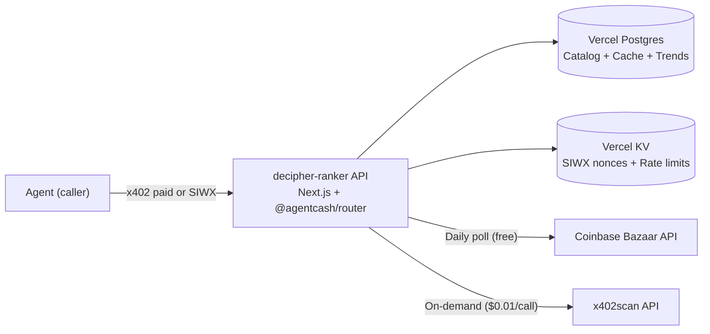

# decipher-ranker — x402 Service Architecture

**Date:** 2026-06-29
**Status:** Preliminary Architecture — ready for coding agent
**Domain:** decipher-ranker.com
**Hosting:** Vercel (Next.js App Router)
**Core Library:** @agentcash/router
**Database:** Vercel Postgres (Neon) for analytics data + Vercel KV (Upstash Redis) for router state

---

## Table of Contents

1. Project Overview
2. Prerequisites — Human Actions Required Before Building
3. Tech Stack & Decisions
4. Directory Structure
5. Database Schema
6. Data Pipeline Design
7. Route Implementation Specifications
8. Analytics Engine Design
9. Caching Strategy
10. Environment Variables Reference
11. Deployment Configuration
12. Registration & Discovery on x402scan
13. Validation & Testing
14. Human Actions Checklist (Post-Build)

---

## 1. Project Overview

### What is decipher-ranker?

decipher-ranker is a merchant analytics and ranking service for the AgentCash / x402 ecosystem. It helps API providers (merchants) understand their position in the marketplace by providing:

- **Rank position** within their category (e.g., "You're #7 in 'data enrichment' on Base")
- **Competitor benchmarks** (pricing, volume, buyer diversity, uptime)
- **Category intelligence** (how many competitors, price ranges, median volume)
- **Actionable recommendations** (listing quality, missing tags, semantic gaps)
- **Trend signals** (velocity changes, new entrants, rank movements)

### Problem it solves

The x402 ecosystem has an opaque ranking algorithm. Merchants cannot see:

- Where they rank for relevant search queries
- Who their competitors are and how they compare
- What concrete steps would improve their ranking
- Market trends and category-level dynamics

Solving this is the same gap Ahrefs filled for SEO — merchants know their own data but cannot see the competitive landscape.

### How it works (high level)

1. **Data ingestion**: decipher-ranker polls the Coinbase Bazaar API (free) daily to build a complete catalog of all registered x402 resources. On-demand, it calls x402scan's API ($0.01–0.02 per call) for specific merchant on-chain data.

2. **Analytics computation**: A local analytics engine processes the ingested data to compute rank positions, category assignments, competitor gaps, pricing benchmarks, and trend signals.

3. **Report delivery via x402**: Merchants interact with decipher-ranker through its own x402-protected endpoints. Free (SIWX) endpoints for basic reports. Paid endpoints ($0.03) for competitive deep-dives.

4. **Dogfooding**: decipher-ranker itself is registered as an x402 service on x402scan. Its own transaction volume proves the model works.

### Architecture pattern

decipher-ranker follows a **greenfield standalone service** pattern (not a proxy pattern). It does not wrap an existing production API — it generates its own analytics by composing data from multiple upstream sources (Bazaar API, x402scan API). The x402 payment/discovery layer is built in from day one using `@agentcash/router`.



---

## 2. Prerequisites — Human Actions Required BEFORE Building

These MUST be completed before the coding agent can build and deploy. Each item is a manual step the developer must do.

### 2.1 Domain

| Action | Details |
|--------|---------|
| Purchase domain | Buy `decipher-ranker.com` from any registrar (Namecheap, Cloudflare, etc.) |
| Configure DNS | Add `A` record pointing to `76.76.21.21` (Vercel) or `CNAME` to `cname.vercel-dns.com` |
| Wait for propagation | DNS can take minutes to hours. Verify before deploying. |

### 2.2 Vercel Project

| Action | Details |
|--------|---------|
| Create Vercel account | If you don't have one, sign up at https://vercel.com |
| Connect Git provider | Link your GitHub/GitLab account |
| Create project | Create from GitHub repo (or use `vercel link` after repo is pushed) |
| Set production domain | In Vercel dashboard → Project → Domains → add `decipher-ranker.com` |
| Enable Vercel KV | Vercel Dashboard → Storage → Create KV → link to project |
| Enable Vercel Postgres | Vercel Dashboard → Storage → Create Postgres → link to project |

**Important:** Vercel KV creates `KV_REST_API_URL` and `KV_REST_API_TOKEN` environment variables automatically. Vercel Postgres creates `POSTGRES_URL`, `POSTGRES_PRISMA_URL`, etc. automatically. These will show up in the environment variables section of your project dashboard.

### 2.3 CDP API Credentials (Required for x402)

x402 payment verification requires Coinbase Developer Platform credentials.

| Action | Details |
|--------|---------|
| Create CDP account | Go to https://portal.cdp.coinbase.com |
| Create project | Projects → Create Project (any name) |
| Create API Key | API Keys → Create API Key → select **Server** type |
| Save credentials | Copy the **Key ID** (`CDP_API_KEY_ID`) and **Secret** (`CDP_API_KEY_SECRET`) |
| Free tier | CDP has a generous free tier for x402 — no payment needed |

These will go into Vercel environment variables.

### 2.4 Wallet Generation

The router needs EVM wallets. Generate them using Node.js crypto:

```bash
node -e "const c = require('crypto'); console.log('OPERATOR: 0x' + c.randomBytes(32).toString('hex')); console.log('FEE_PAYER: 0x' + c.randomBytes(32).toString('hex'))"
```

To derive addresses, use Foundry's `cast` (already in your toolchain):

```bash
cast wallet address --private-key 0x<operator-private-key>
cast wallet address --private-key 0x<fee-payer-private-key>
```

| Wallet | Environment Variable | Purpose |
|--------|---------------------|---------|
| Operator | `EVM_PAYEE_ADDRESS` + `MPP_OPERATOR_KEY` | Receives payments from callers |
| Fee-payer | `MPP_FEE_PAYER_KEY` | Sponsors caller gas on Tempo (optional — recommend **omit** initially to let callers pay their own gas) |

**Security:** These private keys are sensitive. Store them in Vercel Environment Variables (encrypted), never in the codebase.

### 2.5 MPP Secret Key

If enabling MPP protocol (recommended for maximum agent compatibility):

```bash
openssl rand -hex 32
```

This becomes `MPP_SECRET_KEY`. **Must be persisted** — rotating it invalidates outstanding 402 challenges.

### 2.6 Contact Email

Acquire a contact email to include in the OpenAPI `info.contact.email` field. This enables origin ownership verification on x402scan and Poncho customization.

### 2.7 AgentCash Wallet Balance

You already have an AgentCash wallet with ~$13.84 on Base. This will be used to call x402scan's API for data fetching (not for receiving payments). No additional funding needed at MVP stage.

---

## 3. Tech Stack & Decisions

### 3.1 Stack

| Layer | Technology | Reason |
|-------|-----------|--------|
| Framework | Next.js 15+ (App Router) | Required by @agentcash/router; also powers the analytics dashboard when built |
| Router | @agentcash/router | Handles x402/MPP payment verification, SIWX auth, OpenAPI discovery, all from the route registry |
| Language | TypeScript (strict mode) | Type safety across the data pipeline and route handlers |
| Validation | Zod v4 | Peer dependency of @agentcash/router; used for request/response validation |
| ORM | Drizzle ORM or Prisma | For type-safe database access. Drizzle is lighter, Prisma is more ergonomic. Either works. |
| Database | Vercel Postgres (Neon) | Serverless PostgreSQL for merchant catalog, cached analytics, trend data |
| KV Store | Vercel KV (Upstash Redis) | Required by @agentcash/router for SIWX nonces, MPP replay protection, rate limiting |
| HTTP Client | fetch (built-in) + undici | For calling Bazaar API and x402scan API |
| Scheduling | Vercel Cron Jobs | For daily Bazaar API polling (free on Vercel Hobby/Pro) |
| Deployment | Vercel | Native Next.js support, auto-generated env vars for KV/Postgres |

### 3.2 Key Package Versions (lock at these)

```json
{
  "next": "^15.0.0",
  "react": "^18.3.0",
  "@agentcash/router": "latest",
  "zod": "^4.0.0",
  "drizzle-orm": "^0.35.0",
  "@neondatabase/serverless": "^0.10.0",
  "viem": "^2.0.0"
}
```

### 3.3 Why this stack

- **@agentcash/router** is the official SDK from Merit Systems (creators of x402scan and AgentCash). It handles payment verification, SIWX authentication, OpenAPI generation, and discovery — everything needed to be a listed x402 service.
- **Vercel** is the recommended hosting platform for `@agentcash/router`. Environment variables like `KV_REST_API_URL` and `POSTGRES_URL` are auto-generated when you provision storage.
- **PostgreSQL** is recommended over SQLite because the analytics queries involve joins across merchants, resources, categories, and time-series data — PostgreSQL handles this much better and is available as a managed serverless database on Vercel.

---

## 4. Directory Structure

```
/decipher-ranker/
├── .github/
│   └── workflows/
│       └── ci.yml                        # Lint + typecheck + test on push
├── app/
│   ├── api/
│   │   ├── report/
│   │   │   ├── origin/
│   │   │   │   └── route.ts              # POST — Free SIWX report
│   │   │   ├── competitive/
│   │   │   │   └── route.ts              # POST — Paid competitive analysis
│   │   │   └── merchant/
│   │   │       └── route.ts              # POST — Paid merchant deep-dive
│   │   ├── categories/
│   │   │   └── route.ts                  # GET — Browse categories (free)
│   │   └── leaderboard/
│   │       └── route.ts                  # GET — Weekly top 50 (free)
│   ├── openapi.json/
│   │   └── route.ts                      # Auto-generated OpenAPI spec
│   ├── .well-known/
│   │   └── x402/
│   │       └── route.ts                  # Auto-generated x402 discovery
│   └── llms.txt/
│       └── route.ts                      # Auto-generated LLM guide
├── lib/
│   ├── router.ts                         # createRouterFromEnv bootstrap
│   ├── routes-barrel.ts                  # Import all route modules
│   ├── db/
│   │   ├── index.ts                      # Database client (Neon serverless)
│   │   └── schema.ts                     # Drizzle/Prisma schema definition
│   ├── data-sources/
│   │   ├── bazaar.ts                     # Coinbase Bazaar API client
│   │   └── x402scan.ts                   # x402scan API client
│   ├── analytics/
│   │   ├── ranker.ts                     # Rank computation engine
│   │   ├── categorizer.ts                # Category detection/matching
│   │   └── comparator.ts                 # Competitor gap analysis
│   ├── cache.ts                          # Redis-based caching layer
│   ├── pricing.ts                        # Pricing functions for .paid() routes
│   └── types.ts                          # Shared TypeScript types
├── scripts/
│   ├── seed-from-bazaar.ts               # Initial data seed from Bazaar API
│   └── refresh-catalog.ts                # Daily catalog refresh (called by cron)
├── drizzle/
│   └── migrations/                       # Database migrations
├── tests/
│   ├── api/
│   │   ├── report-origin.test.ts
│   │   ├── report-competitive.test.ts
│   │   ├── report-merchant.test.ts
│   │   ├── categories.test.ts
│   │   └── leaderboard.test.ts
│   ├── analytics/
│   │   ├── ranker.test.ts
│   │   ├── categorizer.test.ts
│   │   └── comparator.test.ts
│   └── data-sources/
│       ├── bazaar.test.ts
│       └── x402scan.test.ts
├── .env.example                          # Documented env template
├── .gitignore
├── drizzle.config.ts                     # Drizzle config
├── next.config.ts                        # Next.js config
├── package.json
├── tsconfig.json                         # Strict mode
└── vercel.json                           # Cron job configuration
```

---

## 5. Database Schema

### 5.1 Tables

**`merchants`** — One row per merchant (identified by payee address)

```sql
CREATE TABLE merchants (
  id            UUID PRIMARY KEY DEFAULT gen_random_uuid(),
  payee_address TEXT NOT NULL UNIQUE,          -- 0x... or Solana address
  facilitator   TEXT,                           -- 'coinbase', 'mrdn', 'payAI', 'relai', 'fluxa', etc.
  chain         TEXT NOT NULL DEFAULT 'base',   -- 'base', 'solana', 'tempo'
  first_seen_at TIMESTAMPTZ NOT NULL DEFAULT now(),
  last_updated  TIMESTAMPTZ NOT NULL DEFAULT now(),

  -- Aggregated from x402scan (refreshed on demand)
  tx_count           BIGINT DEFAULT 0,
  total_amount_usd   DECIMAL(20,6) DEFAULT 0,
  unique_buyers      INTEGER DEFAULT 0,
  unique_sellers     INTEGER DEFAULT 0,
  volume_30d         DECIMAL(20,6) DEFAULT 0,
  tx_count_30d       BIGINT DEFAULT 0,
  buyers_30d         INTEGER DEFAULT 0,

  -- Computed by decipher-ranker
  ranker_score       DECIMAL(10,4) DEFAULT 0,  -- Overall ranker composite score
  rank_position      INTEGER,                   -- Position within category
  category_id        UUID REFERENCES categories(id),

  metadata           JSONB DEFAULT '{}'         -- Flexible extra fields
);
```

**`resources`** — Individual API resources (one merchant can have many resources)

```sql
CREATE TABLE resources (
  id              UUID PRIMARY KEY DEFAULT gen_random_uuid(),
  resource_url    TEXT NOT NULL,                  -- e.g. https://mesh.heurist.xyz/x402/agents/...
  merchant_id     UUID NOT NULL REFERENCES merchants(id),
  origin_id       UUID,
  service_name    TEXT,
  description     TEXT,
  tags             TEXT[],                        -- Array of tag names
  tool_calls      INTEGER DEFAULT 0,             -- _count.toolCalls from x402scan
  price_usd       DECIMAL(10,6),                 -- From accepts[0] or median
  chain           TEXT,

  -- Bazaar API metadata (if monitored)
  l30d_calls      INTEGER,
  l30d_unique_payers INTEGER,
  last_called_at  TIMESTAMPTZ,
  overall_score   DECIMAL(5,4),                  -- Bazaar confidence.overallScore
  volume_score    DECIMAL(5,4),
  recency_score   DECIMAL(5,4),
  performance_score DECIMAL(5,4),
  reliability_score DECIMAL(5,4),
  avg_latency_ms  INTEGER,
  api_success_rate DECIMAL(5,4),

  first_seen_at   TIMESTAMPTZ NOT NULL DEFAULT now(),
  last_updated    TIMESTAMPTZ NOT NULL DEFAULT now()
);
```

**`categories`** — Tag/category groups

```sql
CREATE TABLE categories (
  id            UUID PRIMARY KEY DEFAULT gen_random_uuid(),
  name          TEXT NOT NULL UNIQUE,            -- e.g. 'Search', 'Data Enrichment', 'Utility'
  color         TEXT,                             -- Hex color from x402scan tags
  description   TEXT,
  merchant_count INTEGER DEFAULT 0,
  median_price   DECIMAL(10,6),
  created_at    TIMESTAMPTZ NOT NULL DEFAULT now()
);
```

**`trends`** — Daily snapshots for time-series analysis

```sql
CREATE TABLE trends (
  id            UUID PRIMARY KEY DEFAULT gen_random_uuid(),
  merchant_id   UUID NOT NULL REFERENCES merchants(id),
  snapshot_date DATE NOT NULL,
  rank_position INTEGER,
  ranker_score  DECIMAL(10,4),
  tx_count_30d  BIGINT,
  unique_buyers INTEGER,
  total_amount  DECIMAL(20,6),

  UNIQUE(merchant_id, snapshot_date)
);
```

**`reports`** — Auditable report history (per-report billing audit)

```sql
CREATE TABLE reports (
  id              UUID PRIMARY KEY DEFAULT gen_random_uuid(),
  requester_wallet TEXT NOT NULL,                -- Wallet address that paid
  report_type     TEXT NOT NULL,                  -- 'origin', 'competitive', 'merchant'
  input_params    JSONB,                          -- What was requested
  cost_usdc       DECIMAL(10,6),                  -- What they paid
  created_at      TIMESTAMPTZ NOT NULL DEFAULT now()
);
```

**`category_cache`** — Cached category-level aggregations

```sql
CREATE TABLE category_cache (
  id              UUID PRIMARY KEY DEFAULT gen_random_uuid(),
  category_name   TEXT NOT NULL UNIQUE,
  merchant_count  INTEGER,
  total_volume_30d DECIMAL(20,6),
  median_price    DECIMAL(10,6),
  avg_buyers      DECIMAL(10,2),
  top_merchants   JSONB,                          -- [{address, rank, score, volume}]
  refreshed_at    TIMESTAMPTZ NOT NULL DEFAULT now()
);
```

### 5.2 Indexes

```sql
CREATE INDEX idx_merchants_category ON merchants(category_id);
CREATE INDEX idx_merchants_score ON merchants(ranker_score DESC);
CREATE INDEX idx_resources_merchant ON resources(merchant_id);
CREATE INDEX idx_resources_tags ON resources USING GIN(tags);
CREATE INDEX idx_trends_merchant_date ON trends(merchant_id, snapshot_date DESC);
CREATE INDEX idx_reports_wallet ON reports(requester_wallet);
```

### 5.3 Database client setup

Use `@neondatabase/serverless` with Drizzle ORM for type-safe queries:

```typescript
// lib/db/index.ts
import { neon } from '@neondatabase/serverless';
import { drizzle } from 'drizzle-orm/neon-http';
import * as schema from './schema';

const sql = neon(process.env.POSTGRES_URL!);
export const db = drizzle(sql, { schema });
```

---

## 6. Data Pipeline Design

### 6.1 Daily catalog refresh from Bazaar API

The Coinbase Bazaar API (free, no auth) is the primary data source for the merchant catalog.

**Process:**
1. **Call**: `GET https://api.cdp.coinbase.com/platform/v2/x402/discovery/resources?limit=100&offset=N`
2. **Paginate**: 24,559 resources across ~246 pages. Sequential fetch (respect rate limits).
3. **Extract**: For each resource, extract `payTo` address (merchant identity), `serviceName`, `description`, `tags`, `quality` metrics, `accepts` pricing, `extensions.bazaar.info` (schema).
4. **Upsert**: Insert/update into `resources` + `merchants` tables.
5. **Recategorize**: Update `categories` table based on unique tags.
6. **Frequency**: Daily. Runs via Vercel Cron Jobs (cron: `0 6 * * *` → 6 AM daily).

```typescript
// lib/data-sources/bazaar.ts

interface BazaarResource {
  resource: string;
  type: string;
  serviceName: string | null;
  description: string | null;
  tags: string[];
  quality: {
    l30DaysTotalCalls: number;
    l30DaysUniquePayers: number;
    lastCalledAt: string;
  } | null;
  accepts: Array<{
    amount: string;
    asset: string;
    network: string;
    payTo: string;
    scheme: string;
  }>;
  extensions?: {
    bazaar?: {
      info?: {
        input?: { type: string; method: string };
        output?: { type: string; example?: unknown };
      };
    };
  };
}

export async function fetchAllBazaarResources(): Promise<BazaarResource[]> {
  const all: BazaarResource[] = [];
  let offset = 0;
  const limit = 100;

  while (true) {
    const url = `https://api.cdp.coinbase.com/platform/v2/x402/discovery/resources?limit=${limit}&offset=${offset}`;
    const res = await fetch(url);
    const data = await res.json();
    all.push(...data.items);
    if (offset + limit >= data.pagination.total) break;
    offset += limit;
    // Rate limit: 100ms delay between pages
    await new Promise(r => setTimeout(r, 100));
  }

  return all;
}
```

### 6.2 On-demand merchant data from x402scan (paid)

When a report is requested, decipher-ranker may need specific merchant data from x402scan's API.

**Process:**
1. **Check cache first**: If we have fresh (<1 hour) data for this merchant, use it.
2. **Fetch**: Call x402scan paid endpoints:
   - `GET /api/x402/merchants/{address}/stats?timeframe=30&chain=base` — $0.01
   - `GET /api/x402/merchants/{address}/transactions?page_size=5&sort_by=amount&sort_order=desc` — $0.01 (for top txns)
   - `GET /api/x402/origins/{originId}/resources` — $0.01 (for resource-level data)
3. **Cache**: Store result in PostgreSQL with TTL of 1 hour.
4. **Cost pass-through**: The $0.02–$0.03 of upstream API calls is factored into the report price.

```typescript
// lib/data-sources/x402scan.ts

import { agentcash } from '@/lib/agentcash-client';

export async function fetchMerchantStats(address: string, chain: string = 'base') {
  // Check cache first
  const cached = await checkCache(`merchant:stats:${address}:${chain}`);
  if (cached) return cached;

  // Fetch from x402scan (paid call)
  const url = `https://x402scan.com/api/x402/merchants/${address}/stats?timeframe=30&chain=${chain}`;
  const response = await fetch(url, {
    headers: { 'X-Payment': 'x402' }  // @agentcash/router handles this
  });
  const data = await response.json();

  // Cache for 1 hour
  await setCache(`merchant:stats:${address}:${chain}`, data, 3600);

  return data;
}
```

**Important implementation note:** decipher-ranker itself needs to call x402scan's x402-protected endpoints. This means decipher-ranker's backend must have an AgentCash wallet (which you already have at `~/.agentcash/`) and use it to pay x402scan for data. The `@agentcash/router` is for exposing endpoints to callers — the backend's own outbound calls to x402scan use the AgentCash CLI's fetch mechanism or direct HTTP with the wallet's private key.

Alternatively (simpler): decipher-ranker can use `npx agentcash fetch` via a child process for outbound x402 calls, or use the AgentCash MCP server locally if running on a VPS. For Vercel, the cleanest approach is to set up the AgentCash wallet on the deployment and use `@agentcash/fetch` package if available, or preload a funded private key to call x402scan's API directly via x402 protocol.

**Recommendation for MVP:** The analytics engine can compute most reports from Bazaar API data alone (free). The on-demand x402scan calls for specific merchant stats can be done via a helper function that uses the AgentCash-wired wallet on the Vercel deployment (set the private key as an env var and use viem to sign x402 requests). This avoids the complexity of shelling out to `npx`.

### 6.3 Data freshness rules

| Data | Source | Cost | Freshness | Strategy |
|------|--------|------|-----------|----------|
| Merchant catalog | Bazaar API | Free | 24 hours | Daily cron poll |
| Resource metadata | Bazaar API | Free | 24 hours | Daily cron poll |
| Category/tag listings | Bazaar API | Free | 24 hours | Daily cron poll |
| Merchant stats (tx count, volume, buyers) | x402scan | $0.01 | 1 hour | On-demand + cache |
| Merchant transactions | x402scan | $0.01 | 1 hour | On-demand + cache |
| Origin resources | x402scan | $0.01 | 1 hour | On-demand + cache |
| Rank positions | Computed | — | 24 hours | Recalculated after daily refresh |
| Trends | Computed | — | 24 hours | Snapshot after daily refresh |
| Category cache | Computed | — | 24 hours | Recalculated after daily refresh |

---

## 7. Route Implementation Specifications

### 7.1 Route: POST /report/origin — Free SIWX endpoint

**Auth mode:** SIWX (wallet identity proof, no payment)

**Purpose:** Any merchant can get a free basic report about their API origin. This is the lead generation endpoint.

**Implementation:**

```typescript
// app/api/report/origin/route.ts
import { z } from 'zod';
import { router } from '@/lib/router';
import { getMerchantByOrigin, computeBasicReport } from '@/lib/analytics/ranker';

const OriginRequestSchema = z.object({
  origin: z.string().url().describe('The origin URL of the merchant (e.g. https://mesh.heurist.xyz)'),
});

export const POST = router
  .route({ path: 'report/origin' })
  .siwx()                                       // Free — just wallet identity
  .body(OriginRequestSchema)
  .description('Get a free basic ranking report for your API origin. Returns category, competitor count, price position, and improvement tips.')
  .tags(['Reports', 'Free'])
  .inputExample({ origin: 'https://mesh.heurist.xyz' })
  .handler(async ({ body, wallet }) => {
    // 1. Resolve the origin to a merchant
    const merchant = await getMerchantByOrigin(body.origin);
    if (!merchant) {
      return {
        found: false,
        origin: body.origin,
        message: 'This origin is not yet indexed. It may take up to 24 hours after registration on x402scan to appear.',
      };
    }

    // 2. Compute basic report
    const report = await computeBasicReport(merchant);

    // 3. Return result (no payment, no audit trail needed)
    return {
      found: true,
      origin: body.origin,
      category: report.category,
      rank_position: report.rankPosition,
      total_competitors: report.totalCompetitors,
      price_position: report.pricePosition,        // 'below_median', 'median', 'above_median'
      description_quality: report.descriptionQuality,  // score 0-100
      listing_completeness: report.listingCompleteness, // score 0-100
      tips: report.tips,                            // 3 actionable improvement tips
      last_updated: merchant.last_updated,
    };
  });
```

**Response schema:**

```typescript
{
  found: boolean;
  origin: string;
  // If found = true:
  category?: string;
  rank_position?: number;          // e.g. 7 — null if not ranked
  total_competitors?: number;      // e.g. 42
  price_position?: 'below_median' | 'median' | 'above_median';
  description_quality?: number;    // 0-100
  listing_completeness?: number;   // 0-100
  tips?: string[];                 // 3 items
  last_updated?: string;
  // If found = false:
  message?: string;
}
```

### 7.2 Route: POST /report/competitive — Paid x402 endpoint

**Auth mode:** Paid (fixed $0.03 via x402)

**Purpose:** Deep competitive analysis — see top competitors in your category with gap analysis.

**Implementation:**

```typescript
// app/api/report/competitive/route.ts
import { z } from 'zod';
import { router } from '@/lib/router';
import { getMerchantByOrigin, computeCompetitiveReport } from '@/lib/analytics/ranker';

const CompetitiveRequestSchema = z.object({
  origin: z.string().url().describe('Your API origin URL'),
});

export const POST = router
  .route({ path: 'report/competitive' })
  .paid('0.03')                                    // $0.03 fixed price
  .body(CompetitiveRequestSchema)
  .description('Get a detailed competitive analysis. Returns top 10 competitors in your category with gap analysis, pricing benchmarks, and recommendations.')
  .tags(['Reports', 'Paid'])
  .inputExample({ origin: 'https://mesh.heurist.xyz' })
  .handler(async ({ body, wallet }) => {
    const merchant = await getMerchantByOrigin(body.origin);
    if (!merchant) {
      return {
        found: false,
        message: 'Origin not found in index. Try the free /report/origin endpoint first.',
      };
    }

    // Compute competitive report (may trigger x402scan API calls — cost ~$0.01-0.02)
    const report = await computeCompetitiveReport(merchant);

    // Audit trail: log the report for billing accountability
    await db.insert(reports).values({
      requester_wallet: wallet,
      report_type: 'competitive',
      input_params: { origin: body.origin },
      cost_usdc: 0.03,
    });

    return {
      found: true,
      origin: body.origin,
      category: report.category,
      your_rank: report.yourRank,
      total_competitors: report.totalCompetitors,
      competitors: report.topCompetitors.slice(0, 10).map(c => ({
        origin: c.origin,
        rank: c.rank,
        score: c.score,
        price: c.price,
        unique_buyers: c.uniqueBuyers,
        tool_calls: c.toolCalls,
        description_length: c.descriptionLength,
      })),
      gap_analysis: report.gapAnalysis,            // keywords/tags they have that you don't
      pricing_benchmark: {
        your_price: report.yourPrice,
        category_median: report.medianPrice,
        category_min: report.minPrice,
        category_max: report.maxPrice,
        percentile: report.pricePercentile,
      },
      recommendations: report.recommendations,     // 5 actionable items
    };
  });
```

**Paid endpoint behavior:** @agentcash/router automatically:
1. Responds with `402 Payment Required` and payment metadata on unpaid requests
2. Verifies the x402 payment proof on retry
3. Passes the payer's `wallet` address into the handler
4. Settles the payment on-chain after a successful 2xx response

### 7.3 Route: POST /report/merchant — Paid x402 endpoint

**Auth mode:** Paid (fixed $0.03 via x402)

**Purpose:** Deep-dive on a single merchant by their payee address — full stats, trends, and recommendations.

**Implementation:**

```typescript
// app/api/report/merchant/route.ts
import { z } from 'zod';
import { router } from '@/lib/router';
import { getMerchantByAddress, computeMerchantDeepDive } from '@/lib/analytics/ranker';

const MerchantRequestSchema = z.object({
  address: z.string().min(32).max(48).describe('The payee address (EVM or Solana) of the merchant'),
  chain: z.enum(['base', 'solana']).optional().default('base').describe('Blockchain network'),
});

export const POST = router
  .route({ path: 'report/merchant' })
  .paid('0.03')
  .body(MerchantRequestSchema)
  .description('Get a detailed merchant deep-dive by wallet address. Returns volume stats, buyer diversity, trend signals, and recommendations.')
  .tags(['Reports', 'Paid'])
  .inputExample({ address: '0xe9030014f5dae217d0a152f02a043567b16c1abf', chain: 'base' })
  .handler(async ({ body, wallet }) => {
    const merchant = await getMerchantByAddress(body.address, body.chain);
    if (!merchant) {
      return { found: false, message: 'Merchant not found. Try a different address.' };
    }

    const report = await computeMerchantDeepDive(merchant);

    await db.insert(reports).values({
      requester_wallet: wallet,
      report_type: 'merchant',
      input_params: { address: body.address, chain: body.chain },
      cost_usdc: 0.03,
    });

    return {
      found: true,
      address: body.address,
      chain: body.chain,
      service_name: report.serviceName,
      category: report.category,
      rank: report.rank,
      volume: {
        total_transactions: report.totalTxns,
        total_volume_usd: report.totalVolumeUsd,
        volume_30d: report.volume30d,
        tx_count_30d: report.txCount30d,
      },
      buyers: {
        total_unique: report.totalUniqueBuyers,
        unique_30d: report.uniqueBuyers30d,
        concentration: report.buyerConcentration, // Top 3 buyer percentage
        diversity_score: report.diversityScore,   // 0-100
      },
      pricing: {
        price_usd: report.price,
        vs_category: report.priceVsCategory,
      },
      trends: report.trends.slice(-30),            // Last 30 days of rank position
      recommendations: report.recommendations,
    };
  });
```

### 7.4 Route: GET /categories — Free unprotected endpoint

**Auth mode:** Unprotected (no payment, no wallet identity)

**Purpose:** Public catalog of API categories — browse the landscape.

```typescript
// app/api/categories/route.ts
import { router } from '@/lib/router';
import { db } from '@/lib/db';
import { categories } from '@/lib/db/schema';

export const GET = router
  .route({ path: 'categories' })
  .unprotected()
  .method('GET')
  .description('Browse all API categories with merchant counts, price ranges, and top players.')
  .tags(['Discovery', 'Free'])
  .handler(async () => {
    const cats = await db.query.categories.findMany({
      orderBy: (c, { desc }) => [desc(c.merchant_count)],
    });

    const transformed = await Promise.all(cats.map(async (cat) => {
      const topMerchants = await db.query.merchants.findMany({
        where: (m, { eq }) => eq(m.category_id, cat.id),
        orderBy: (m, { desc }) => [desc(m.ranker_score)],
        limit: 3,
        columns: { payee_address: true, ranker_score: true, tx_count_30d: true },
      });

      return {
        name: cat.name,
        merchant_count: cat.merchant_count,
        median_price_usd: cat.median_price ? Number(cat.median_price) : null,
        top_merchants: topMerchants.map(m => ({
          address: m.payee_address,
          score: m.ranker_score,
          volume_30d: m.tx_count_30d,
        })),
      };
    }));

    return { categories: transformed, total: transformed.length };
  });
```

### 7.5 Route: GET /leaderboard — Free unprotected endpoint

**Auth mode:** Unprotected (no payment, no wallet identity)

**Purpose:** Weekly top 50 APIs by category — public marketing asset.

```typescript
// app/api/leaderboard/route.ts
import { z } from 'zod';
import { router } from '@/lib/router';
import { db } from '@/lib/db';

const LeaderboardQuerySchema = z.object({
  category: z.string().optional().describe('Filter by category name'),
  limit: z.coerce.number().min(1).max(100).optional().default(50).describe('Number of results'),
});

export const GET = router
  .route({ path: 'leaderboard' })
  .unprotected()
  .method('GET')
  .query(LeaderboardQuerySchema)
  .description('Top APIs by category. Weekly snapshot of the highest-ranked services on x402.')
  .tags(['Discovery', 'Free'])
  .handler(async ({ query }) => {
    const where = query.category
      ? (m, { eq, and }) => and(
          eq(m.category_id, db.select({ id: categories.id })
            .from(categories)
            .where(eq(categories.name, query.category!))
            .limit(1)),
        )
      : undefined;

    const results = await db.query.merchants.findMany({
      where,
      orderBy: (m, { desc }) => [desc(m.ranker_score)],
      limit: query.limit,
      columns: {
        payee_address: true,
        ranker_score: true,
        rank_position: true,
        tx_count_30d: true,
        unique_buyers: true,
        total_amount_usd: true,
      },
    });

    return {
      generated_at: new Date().toISOString(),
      category: query.category ?? 'all',
      count: results.length,
      leaderboard: results.map((m, i) => ({
        rank: i + 1,
        address: m.payee_address,
        score: m.ranker_score,
        tx_count_30d: m.tx_count_30d,
        unique_buyers_30d: m.unique_buyers,
        volume_usd_30d: m.total_amount_usd ? Number(m.total_amount_usd) : null,
      })),
    };
  });
```

### 7.6 Discovery Handlers

These three files are mandated by @agentcash/router and must be wired:

```typescript
// app/openapi.json/route.ts
import { router } from '@/lib/router';
import '@/lib/routes-barrel';   // Critical — imports all route modules

export const GET = router.openapi();


// app/.well-known/x402/route.ts
import { router } from '@/lib/router';
import '@/lib/routes-barrel';

export const GET = router.wellKnown();


// app/llms.txt/route.ts
import { router } from '@/lib/router';

export const GET = router.llmsTxt();
```

### 7.7 Route Barrel

```typescript
// lib/routes-barrel.ts
// Import every route module for its side effects (registers routes in the router registry)
import '@/app/api/report/origin/route';
import '@/app/api/report/competitive/route';
import '@/app/api/report/merchant/route';
import '@/app/api/categories/route';
import '@/app/api/leaderboard/route';
```

---

## 8. Analytics Engine Design

### 8.1 Router initialization

```typescript
// lib/router.ts
import { createRouterFromEnv } from '@agentcash/router';

export const router = createRouterFromEnv({
  title: 'decipher-ranker',
  description: 'Merchant analytics and ranking for the x402 ecosystem. Get rank position, competitor benchmarks, pricing analysis, and improvement recommendations.',
  guidance: `decipher-ranker helps API providers understand their marketplace position.

FREE ENDPOINTS (no payment):
- GET /categories — Browse all API categories with counts
- GET /leaderboard — Top APIs by category
- POST /report/origin — Basic rank report for your origin (SIWX wallet identity required)

PAID ENDPOINTS ($0.03 each):
- POST /report/competitive — Deep competitive analysis with gap analysis
- POST /report/merchant — Deep-dive on any merchant by address

The free /report/origin endpoint requires wallet identity (SIWX) but no payment. Paid endpoints use x402 micropayment in USDC on Base.`,
  strictRoutes: true,          // Recommended for new projects
  contact: {
    email: 'YOUR_EMAIL@example.com',  // ← SET THIS
  },
});
```

### 8.2 Rank computation algorithm

The ranker score is computed from verifiable data sources. It does NOT attempt to replicate x402scan's proprietary ranking (which includes the opaque `trustedUserUsageRatio`). Instead, it computes a transparent, reproducible score.

**Score formula:**

```
RankerScore = 0.30 × volumeSignal + 0.25 × buyerDiversity + 0.15 × reliability + 0.15 × listingQuality + 0.15 × recency
```

**Volume signal** (30%):
- Normalized log of 30-day transaction count
- Normalized log of 30-day total volume (USDC)
- `score = 0.5 × logNorm(tx_count_30d) + 0.5 × logNorm(volume_30d)`

**Buyer diversity** (25%):
- Normalized unique buyer count (log scale)
- Concentration penalty: if top-3 buyers account for >70% of volume, penalize
- `score = buyerNorm - concentrationPenalty`

**Reliability** (15%):
- Uses Bazaar API `reliabilityScore` when available
- Falls back to `api_success_rate` from x402scan tool calls
- Baseline 0.5 if no data available
- `score = reliabilityScore ?? apiSuccessRate ?? 0.5`

**Listing quality** (15%):
- Description length score: >150 words = 1.0, >50 words = 0.6, >0 words = 0.3, null = 0
- Input schema presence: 0.3
- Output schema presence: 0.3
- Example in schema: 0.2
- Tags array not empty: 0.2
- `score = descScore + (schema/example/tags bonuses)`

**Recency** (15%):
- Days since `last_called_at` or `last_updated`
- <1 day = 1.0, <7 days = 0.8, <30 days = 0.5, <90 days = 0.2, >90 = 0
- `score = recencyScore`

```typescript
// lib/analytics/ranker.ts

export function computeRankerScore(merchant: MerchantData, category: CategoryData): number {
  const volumeSignal = 0.5 * logNorm(merchant.txCount30d) + 0.5 * logNorm(merchant.volume30d);
  const buyerDiversity = computeBuyerDiversity(merchant.uniqueBuyers30d, merchant.topBuyerConcentration);
  const reliability = merchant.reliabilityScore ?? merchant.apiSuccessRate ?? 0.5;
  const listingQuality = computeListingQuality(merchant);
  const recency = computeRecency(merchant.lastCalledAt);

  return 0.30 * volumeSignal + 0.25 * buyerDiversity + 0.15 * reliability + 0.15 * listingQuality + 0.15 * recency;
}

function logNorm(value: number, cap: number = 1_000_000): number {
  if (value <= 0) return 0;
  return Math.min(Math.log10(value + 1) / Math.log10(cap), 1);
}

function computeListingQuality(merchant: MerchantData): number {
  let score = 0;

  // Description quality
  const descLen = merchant.description?.length ?? 0;
  if (descLen > 150) score += 1.0;
  else if (descLen > 50) score += 0.6;
  else if (descLen > 0) score += 0.3;
  else score += 0;

  // Input schema present
  if (merchant.hasInputSchema) score += 0.3;

  // Output schema present
  if (merchant.hasOutputSchema) score += 0.3;

  // Example in schema
  if (merchant.hasSchemaExample) score += 0.2;

  // Tags
  if (merchant.tags && merchant.tags.length > 0) score += 0.2;

  // Normalize to 0-1
  return Math.min(score / 2.0, 1);
}
```

### 8.3 Category detection

Each resource has tags from the Bazaar API. Categories are derived from unique tag names.

```typescript
// lib/analytics/categorizer.ts

export function assignCategory(resource: ResourceData, categories: CategoryData[]): string | null {
  if (!resource.tags || resource.tags.length === 0) return null;

  // Direct tag-to-category match
  for (const tag of resource.tags) {
    const match = categories.find(c => c.name.toLowerCase() === tag.toLowerCase());
    if (match) return match.name;
  }

  // If no direct match, find closest by tag similarity
  // (MVP: return the tag itself as a category)
  return resource.tags[0];
}
```

### 8.4 Competitor gap analysis

```typescript
// lib/analytics/comparator.ts

export function computeGapAnalysis(merchant: MerchantData, competitors: MerchantData[]): GapAnalysis {
  const competitorTags = new Set<string>();
  for (const comp of competitors) {
    for (const tag of comp.tags ?? []) {
      competitorTags.add(tag.toLowerCase());
    }
  }

  const merchantTags = new Set((merchant.tags ?? []).map(t => t.toLowerCase()));
  const missingTags = [...competitorTags].filter(t => !merchantTags.has(t));

  // Semantic use-cases: keywords in description
  const extractKeywords = (desc: string): string[] => {
    const stopWords = new Set(['the', 'a', 'an', 'and', 'or', 'for', 'with', 'this', 'that']);
    return desc.toLowerCase()
      .replace(/[^a-z0-9\s]/g, '')
      .split(/\s+/)
      .filter(w => w.length > 3 && !stopWords.has(w));
  };

  const merchantKeywords = new Set(extractKeywords(merchant.description ?? ''));
  const compKeywords = new Set<string>();
  for (const comp of competitors) {
    for (const kw of extractKeywords(comp.description ?? '')) {
      compKeywords.add(kw);
    }
  }
  const missingKeywords = [...compKeywords].filter(k => !merchantKeywords.has(k));

  return {
    missingTags: missingTags.slice(0, 10),
    missingKeywords: missingKeywords.slice(0, 10),
    competitorCount: competitors.length,
  };
}
```

---

## 9. Caching Strategy

### 9.1 Redis cache (Vercel KV)

Used for:
- SIWX nonces (handled automatically by @agentcash/router)
- MPP replay protection (handled automatically)
- Rate limiting counters
- Short-lived API response cache (1 hour TTL for x402scan responses)

```typescript
// lib/cache.ts
import { kv } from '@vercel/kv';

export async function checkCache<T>(key: string): Promise<T | null> {
  try {
    return await kv.get<T>(key);
  } catch {
    return null;
  }
}

export async function setCache<T>(key: string, value: T, ttlSeconds: number): Promise<void> {
  try {
    await kv.set(key, value, { ex: ttlSeconds });
  } catch {
    // Cache miss is non-fatal
  }
}
```

### 9.2 PostgreSQL cache

Used for:
- Long-lived merchant catalog data (24 hour refresh)
- Category cache (24 hour refresh)
- Trend snapshots (daily)
- Historical analytics data

### 9.3 Cache invalidation

- **Bazaar data**: Full refresh via daily cron. Old data is replaced.
- **x402scan data**: TTL of 1 hour in Redis. After TTL, fresh data is fetched on next request.
- **Rank positions**: Recalculated after each daily catalog refresh.
- **Category cache**: Recalculated after each daily catalog refresh.

---

## 10. Environment Variables Reference

```bash
# === REQUIRED (service will not start without these) ===

# Public origin URL — must match the domain agents will call
BASE_URL=https://decipher-ranker.com

# EVM address that receives payments
EVM_PAYEE_ADDRESS=0x...

# Coinbase Developer Platform credentials (free tier)
CDP_API_KEY_ID=...
CDP_API_KEY_SECRET=...

# Vercel Postgres connection string (auto-generated when you provision storage)
POSTGRES_URL=postgres://...

# Vercel KV credentials (auto-generated when you provision storage)
KV_REST_API_URL=https://...
KV_REST_API_TOKEN=...


# === OPTIONAL (for MPP support — recommended but not required for MVP) ===

# MPP credentials (setting MPP_SECRET_KEY enables MPP)
MPP_SECRET_KEY=...
MPP_CURRENCY=0x20c000000000000000000000b9537d11c60e8b50  # Tempo USDC

# MPP operator key — must match EVM_PAYEE_ADDRESS
MPP_OPERATOR_KEY=0x...

# MPP fee payer — omit for MVP (callers pay their own gas)
# MPP_FEE_PAYER_KEY=0x...

# Tempo RPC — optional, defaults to public endpoint
# TEMPO_RPC_URL=https://rpc.tempo.xyz


# === OPTIONAL ===

# Contact email for discovery doc
# NEXT_PUBLIC_CONTACT_EMAIL=zaryab@example.com
```

---

## 11. Deployment Configuration

### 11.1 next.config.ts

```typescript
// next.config.ts
import type { NextConfig } from 'next';

const nextConfig: NextConfig = {
  // @agentcash/router requires server runtime
  // No special config needed — App Router is the default
};

export default nextConfig;
```

### 11.2 vercel.json (Cron Jobs)

```json
{
  "crons": [
    {
      "path": "/api/cron/refresh-catalog",
      "schedule": "0 6 * * *"
    }
  ]
}
```

Create the cron handler:

```typescript
// app/api/cron/refresh-catalog/route.ts
import { fetchAllBazaarResources } from '@/lib/data-sources/bazaar';
import { refreshMerchantCatalog } from '@/lib/analytics/ranker';

export async function GET(request: Request) {
  // Verify cron secret to prevent unauthorized invocation
  const auth = request.headers.get('authorization');
  if (auth !== `Bearer ${process.env.CRON_SECRET}`) {
    return new Response('Unauthorized', { status: 401 });
  }

  try {
    const resources = await fetchAllBazaarResources();
    await refreshMerchantCatalog(resources);
    return Response.json({ status: 'ok', resources_indexed: resources.length });
  } catch (error) {
    return Response.json({ status: 'error', message: String(error) }, { status: 500 });
  }
}
```

### 11.3 Database migrations

Use Drizzle Kit for migrations:

```bash
# Generate migration after schema change
npx drizzle-kit generate

# Apply migration
npx drizzle-kit migrate

# On Vercel, run migrations as a post-deploy hook
```

For Vercel deployments, use a `postinstall` script or Vercel's build command:

```json
{
  "scripts": {
    "build": "next build",
    "postinstall": "drizzle-kit migrate"
  }
}
```

### 11.4 tsconfig.json (strict)

```json
{
  "compilerOptions": {
    "target": "ES2022",
    "lib": ["ES2022"],
    "module": "ESNext",
    "moduleResolution": "bundler",
    "strict": true,
    "noUncheckedIndexedAccess": true,
    "exactOptionalPropertyTypes": true,
    "noImplicitOverride": true,
    "noPropertyAccessFromIndexSignature": true,
    "verbatimModuleSyntax": true,
    "isolatedModules": true,
    "jsx": "preserve",
    "incremental": true,
    "plugins": [{ "name": "next" }],
    "paths": { "@/*": ["./*"] }
  },
  "include": ["next-env.d.ts", "**/*.ts", "**/*.tsx"],
  "exclude": ["node_modules"]
}
```

---

## 12. Registration & Discovery on x402scan

### 12.1 What happens automatically

`@agentcash/router` auto-generates:
- **`/openapi.json`** — Full OpenAPI 3.1 spec with x-payment-info on paid routes, SIWX security schemes on SIWX routes, response schemas, input schemas
- **`/.well-known/x402`** — x402 protocol discovery document
- **`/llms.txt`** — LLM-friendly API documentation

This means any route you define with `.paid()` or `.siwx()` is automatically discoverable through these endpoints. No manual spec writing needed.

### 12.2 Manual registration on x402scan

After deployment, register the origin on x402scan:

**Option A: Via API (SIWX, free)**
The coding agent can implement this as a post-deploy script:

```typescript
// scripts/register-origin.ts
// Run after deployment: npx tsx scripts/register-origin.ts
const ORIGIN = 'https://decipher-ranker.com';

// Use AgentCash fetch to register (SIWX auth, free)
const response = await fetch('https://x402scan.com/api/x402/registry/register-origin', {
  method: 'POST',
  headers: {
    'Content-Type': 'application/json',
    'X-SIWX-Auth': '...',  // SIWX-signed challenge
  },
  body: JSON.stringify({ url: ORIGIN }),
});
```

**Option B: Via AgentCash CLI**
```bash
npx agentcash fetch https://x402scan.com/api/x402/registry/register-origin \
  --method POST \
  -b '{"url":"https://decipher-ranker.com"}'
```
This uses SIWX (free, wallet identity) to authenticate.

**Option C: Via x402scan website**
Go to https://x402scan.com/resources/register and enter your origin URL manually.

### 12.3 Validation

After registration, validate the discovery:

```bash
# Check OpenAPI discovery
npx -y @agentcash/discovery@latest check https://decipher-ranker.com

# Discover and validate payment metadata
npx -y @agentcash/discovery@latest discover https://decipher-ranker.com

# Test a paid route end-to-end
npx agentcash@latest fetch https://decipher-ranker.com/api/report/competitive \
  --method POST \
  -b '{"origin":"https://mesh.heurist.xyz"}' \
  -p x402

# Test SIWX route
npx agentcash@latest fetch https://decipher-ranker.com/api/report/origin \
  --method POST \
  -b '{"origin":"https://mesh.heurist.xyz"}'

# Test free endpoints
curl https://decipher-ranker.com/api/categories
curl https://decipher-ranker.com/api/leaderboard
```

---

## 13. Validation & Testing

### 13.1 Test structure

```typescript
// tests/api/report-origin.test.ts
import { describe, it, expect } from 'vitest';

describe('POST /api/report/origin', () => {
  it('returns basic report for a known origin', async () => {
    // Mock Bazaar data → test handler logic
  });

  it('returns not-found for unknown origin', async () => {
    // Test with made-up origin URL
  });

  it('requires SIWX authentication', async () => {
    // Verify 402 challenge is issued without auth
  });
});
```

### 13.2 x402scan data integration test

For testing the on-demand x402scan data fetching (costs $0.01–0.02 per test run), write a separate integration test that can be run manually:

```bash
# Run data integration tests (costs money!)
npm run test:integration -- --paid
```

### 13.3 End-to-end flow test

After deployment, test the full flow:

1. **Free leaderboard**: `curl https://decipher-ranker.com/api/leaderboard`
2. **Free categories**: `curl https://decipher-ranker.com/api/categories`
3. **SIWX report**: `npx agentcash fetch https://decipher-ranker.com/api/report/origin --method POST -b '{"origin":"https://mesh.heurist.xyz"}'`
4. **Paid competitive report**: `npx agentcash fetch https://decipher-ranker.com/api/report/competitive --method POST -b '{"origin":"https://mesh.heurist.xyz"}' -p x402`
5. **Paid merchant report**: `npx agentcash fetch https://decipher-ranker.com/api/report/merchant --method POST -b '{"address":"0xe9030014f5dae217d0a152f02a043567b16c1abf","chain":"base"}' -p x402`

---

## 14. Human Actions Checklist (Post-Build)

These are manual steps that the coding agent cannot automate. Listed in dependency order.

### 14.1 Before deployment

- [ ] **1. Purchase `decipher-ranker.com` domain** — From any registrar
- [ ] **2. Create Vercel account** — If you don't have one
- [ ] **3. Push code to GitHub** — Create repo, push the code
- [ ] **4. Create Vercel project** — Import from GitHub repo
- [ ] **5. Provision Vercel KV** — Vercel Dashboard → Storage → Create KV → Link to project
- [ ] **6. Provision Vercel Postgres** — Vercel Dashboard → Storage → Create Postgres → Link to project
- [ ] **7. Generate CDP API credentials** — https://portal.cdp.coinbase.com → Create API Key (Server type)
- [ ] **8. Generate EVM wallets** — Run `node -e "..."` for operator key; derive address via `cast wallet address`
- [ ] **9. Generate MPP_SECRET_KEY** — `openssl rand -hex 32` (optional for MVP)
- [ ] **10. Set environment variables in Vercel** — Add CDP keys, operator address, contact email, cron secret
- [ ] **11. Set custom domain** — Vercel Dashboard → Project → Domains → Add `decipher-ranker.com`
- [ ] **12. Configure DNS** — Point `decipher-ranker.com` to Vercel nameservers or CNAME
- [ ] **13. Wait for DNS propagation** — Can take minutes to hours

### 14.2 After deployment

- [ ] **14. Run database migrations** — `npx drizzle-kit migrate` or auto-migrate on deploy
- [ ] **15. Seed initial Bazaar catalog** — Trigger the seed script or wait for first cron run
- [ ] **16. Validate OpenAPI discovery** — `npx -y @agentcash/discovery@latest check https://decipher-ranker.com`
- [ ] **17. Register on x402scan** — Via API, CLI, or https://x402scan.com/resources/register
- [ ] **18. Test free endpoints** — `curl` the leaderboard and categories routes
- [ ] **19. Test SIWX report** — Use `npx agentcash fetch` with the origin report endpoint
- [ ] **20. Fund wallet for paid tests** — Ensure AgentCash wallet has Base USDC balance (>$0.03)
- [ ] **21. Test paid competitive report** — Use `npx agentcash fetch` with x402 protocol
- [ ] **22. Test paid merchant report** — Use `npx agentcash fetch` with x402 protocol
- [ ] **23. Verify reports appear on x402scan** — Search for `decipher-ranker.com` on x402scan
- [ ] **24. Set up monitoring** — Vercel analytics, error logging (optional)

### 14.3 Ongoing maintenance

- [ ] **Monitor AgentCash wallet balance** — Outbound calls to x402scan cost $0.01–0.02 each
- [ ] **Monitor report volume and adjust pricing** — If upstream costs change, adjust `$0.03` price
- [ ] **Keep CDP API keys valid** — Rotate if compromised
- [ ] **Refresh Bazaar catalog daily** — Cron job handles this automatically

---

## Appendix A: OpenAPI example shape (auto-generated)

The `/openapi.json` endpoint is auto-generated by `@agentcash/router` from the route registry. Here is the shape it produces for reference:

```jsonc
{
  "openapi": "3.1.0",
  "info": {
    "title": "decipher-ranker",
    "description": "Merchant analytics...",
    "x-guidance": "decipher-ranker helps API providers...",
    "version": "1.0.0",
    "contact": { "email": "..." }
  },
  "paths": {
    "/api/report/origin": {
      "post": {
        "operationId": "reportOrigin",
        "summary": "Get a free basic ranking report for your API origin",
        "tags": ["Reports", "Free"],
        "security": [{ "siwx": [] }],
        "requestBody": {
          "required": true,
          "content": {
            "application/json": {
              "schema": {
                "type": "object",
                "properties": {
                  "origin": { "type": "string", "format": "uri", "description": "The origin URL of the merchant" }
                },
                "required": ["origin"]
              }
            }
          }
        },
        "responses": {
          "200": { "description": "Basic report" },
          "402": { "description": "SIWX wallet authentication required" }
        }
      }
    },
    "/api/report/competitive": {
      "post": {
        "operationId": "reportCompetitive",
        "summary": "Get a detailed competitive analysis",
        "tags": ["Reports", "Paid"],
        "x-payment-info": {
          "price": { "mode": "fixed", "currency": "USD", "amount": "0.030000" },
          "protocols": [{ "x402": {} }]
        },
        "requestBody": { /* ... */ },
        "responses": {
          "200": { "description": "Competitive analysis report" },
          "402": { "description": "Payment Required — x402 micropayment of $0.03" }
        }
      }
    },
    // ... remaining routes
  },
  "components": {
    "securitySchemes": {
      "siwx": { "type": "http", "scheme": "siwx" }
    }
  }
}
```

## Appendix B: Cost analysis per report

| Report | Upstream data cost | decipher-ranker margin | Price to caller |
|--------|-------------------|----------------------|-----------------|
| `/report/origin` (SIWX) | $0.00 (uses cached Bazaar data) | — | Free |
| `/report/competitive` | $0.01–$0.02 (x402scan stats) | $0.01–$0.02 | $0.03 |
| `/report/merchant` | $0.01–$0.02 (x402scan stats + transactions) | $0.01–$0.02 | $0.03 |
| `/categories` | $0.00 (cached) | — | Free |
| `/leaderboard` | $0.00 (cached) | — | Free |

**Daily operating cost (worst case):**
- Bazaar API poll: 246 pages × $0.00 = $0.00 (free)
- On-demand x402scan calls: depends on volume. At 100 reports/day: ~$1.00–$2.00/day
- Vercel hosting: Free tier (Hobby) or $20/month (Pro)
- Vercel KV + Postgres: Free tier (30MB KV, 500MB Postgres) should suffice for MVP

**At $0.03/report with 100 reports/day:** $3.00/day gross revenue, $1.00–$2.00/day data costs = $1.00–$2.00/day net.

---

## Appendix C: Coding agent handoff

When passing this document to a coding agent, use this prompt template:

```
Build the decipher-ranker x402 service based on the architecture document at:
/Users/zar/Code/ai-on-chain/decipher-ranker/preliminary_architecture_decipher_ranker_x402_service.md

Workflow:
1. Read the full architecture document
2. Scaffold a Next.js 15 project with @agentcash/router
3. Implement all 5 API routes as specified
4. Set up the database schema (Drizzle ORM + Neon serverless)
5. Build the analytics engine (ranker, categorizer, comparator)
6. Wire the discovery handlers (openapi.json, .well-known/x402, llms.txt)
7. Add the route barrel
8. Configure all environment variables from .env.example
9. Do NOT deploy — I will handle deployment manually

Prerequisites (already done):
- You can assume I have a funded AgentCash wallet at ~/.agentcash/
- You can assume the domain decipher-ranker.com will be set up later
- Use BASE_URL=https://decipher-ranker.com as default

Key trust points:
- The @agentcash/router package handles all x402 payment verification and OpenAPI generation
- Do NOT manually construct OpenAPI docs — use router.openapi()
- Each route file registers itself in the router via its side-effect import in routes-barrel.ts
- Test with vitest, not jest
